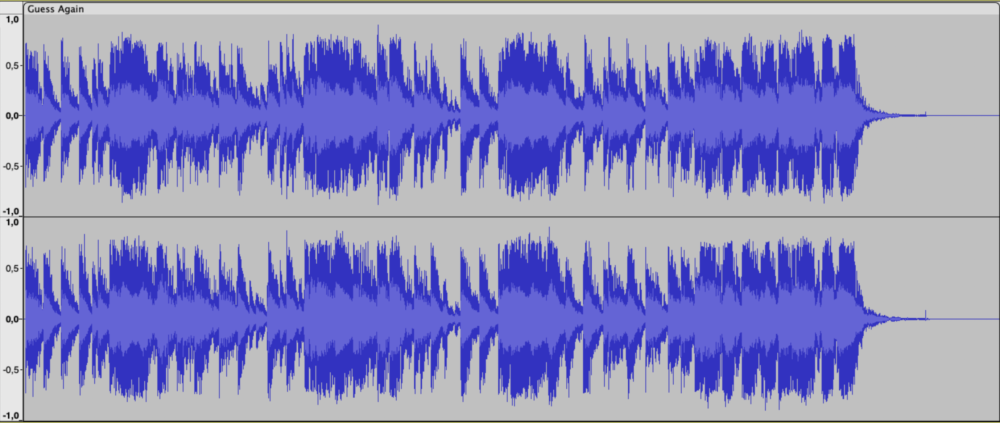

<!-- _class: centered -->
# Make "Game Boy" music in JavaScript

<!-- title slide -- intro -->

<!-- slides for show&tell: https://docs.google.com/presentation/d/16dDLewssNXK05C56JqK6lySWxZ3wHvEqtOgcqQPt5w4/edit#slide=id.g5707f48d32_0_4 -->

---
<!-- _class: topTitle -->
# Do you remember this?

@[youtube](BQwohHgrk2s)

<!-- 
Recently, I felt nostalgic about games from the late 80's. And more specifically about the esthetics of the music from vintage consoles of the era, like the Nintendo Entertainment System and Game Boy.

I wondered what made that sound so unique and recognizable, even for people who have never played these consoles.

Today, I'm gonna share with you a few facts that I found fascinating, while going down the rabbit hole of vintage Nintendo music.
-->

---

1. "Chiptune" basics
2. Howto & tricks
3. Remake in JavaScript

---
<!-- _class: topTitle -->
# Recorded Waveform (PCM)

---
# "Chiptune"

Some people may know that this kind of music is usually called "chip-tune". Why?

- NES: Ricoh 2A03 (custom MOS Technology 6502)
- Game Boy: Sharp LR35902 (hybrid between the Intel 8080 and the Zilog Z80)

Notes are played by synthesizing primitive waveforms (e.g. square, triangle)

Drums and percussions are simulated by moduling the output of a noise generator!

---
<!-- _class: topTitle -->
# Example: Maniac Mansion (NES)

@[youtube](hWAtoCEuwnY)
<!-- ["Maniac Mansion (NES)" Full Soundtrack [Oscilloscope View] - YouTube](https://www.youtube.com/watch?v=hWAtoCEuwnY) -->

---
<!-- _class: topTitle -->
# Waves and channels

---
<!-- _class: topTitle -->
# Example: Super Mario Bros (NES)

@[youtube](OfrEoEQpPrI)
<!-- [[NES] Super Mario Bros.: Main Theme - Oscilloscope View - YouTube](https://www.youtube.com/watch?v=OfrEoEQpPrI) -->

---
<!-- _class: topTitle -->
# Trick: drums on noise + triangle channels

@[youtube](Wy1l5BAkSoc)
<!-- [NES Smurfs: Mountains - oscilloscope view - YouTube](https://www.youtube.com/watch?v=Wy1l5BAkSoc) -->

<!-- Also:
[NES Audio: Triangle Kick Drum - YouTube](https://www.youtube.com/watch?v=Jd6nyynuzio)

=> TODO: Try to give a live example by muting the noise and pulse channels.

-->

---
<!-- _class: topTitle -->
# How was it programmed?

@[youtube](GDP1kyoP8C4)
<!-- [Tetris (Game Boy) - Music Type B (Impulse Tracker Cover) - YouTube](https://www.youtube.com/watch?v=GDP1kyoP8C4) -->

---
<!-- _class: topTitle -->
# Challenge: play Nintendo music live

A bit like this band:
@[youtube](HNs7BVn_bOk)
<!-- [マリオ3 SUPER MARIO BROS. 3 Medley / NES BAND 12th Live in Sapporo - YouTube](https://www.youtube.com/watch?v=HNs7BVn_bOk) -->

---
# ... with my own sound synthesizer!

<!-- DEMO TIME: PLAY TETRIS -->

---
# How it's made

- Keyboard input: WebMIDI
- Tone generator: WebAudio / Oscillators
- Noise-based sounds: http://sfxr.me
- Oscilloscope viz: Canvas (made by Jérôme)

Source: https://github.com/adrienjoly/webmidi-launchkey-mini

---
# Next steps

- implement arpeggiator
- implement tone modulation: duty cycle, ADSR enveloppe
- support more than 1 channel at once
- find other musicians to join the project
- rehearse and give a concert!
