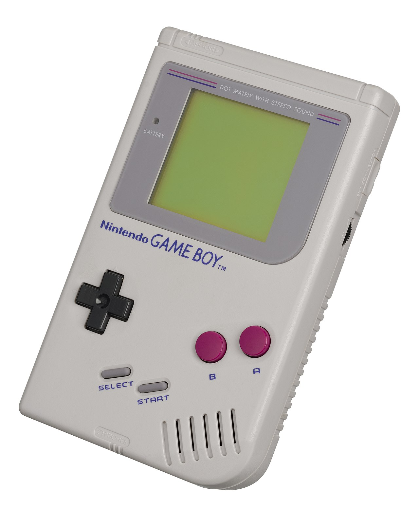
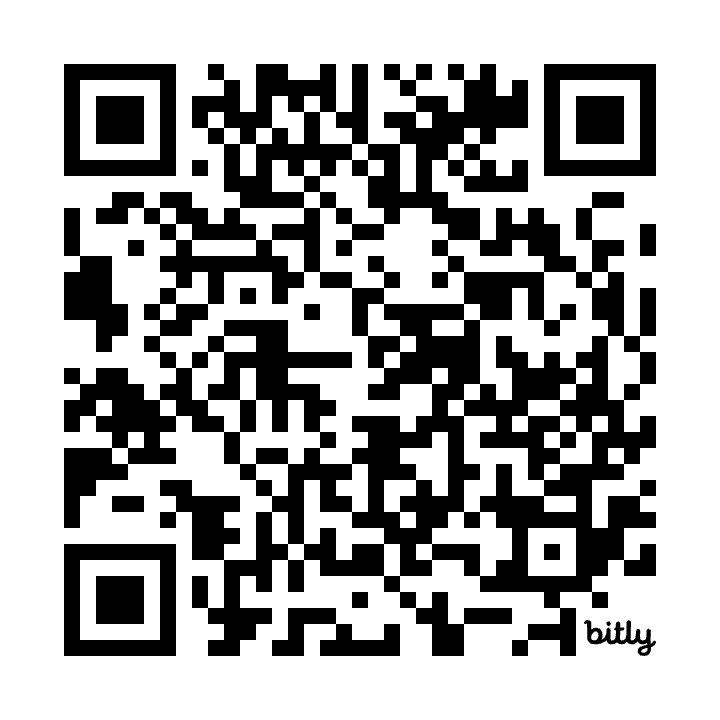
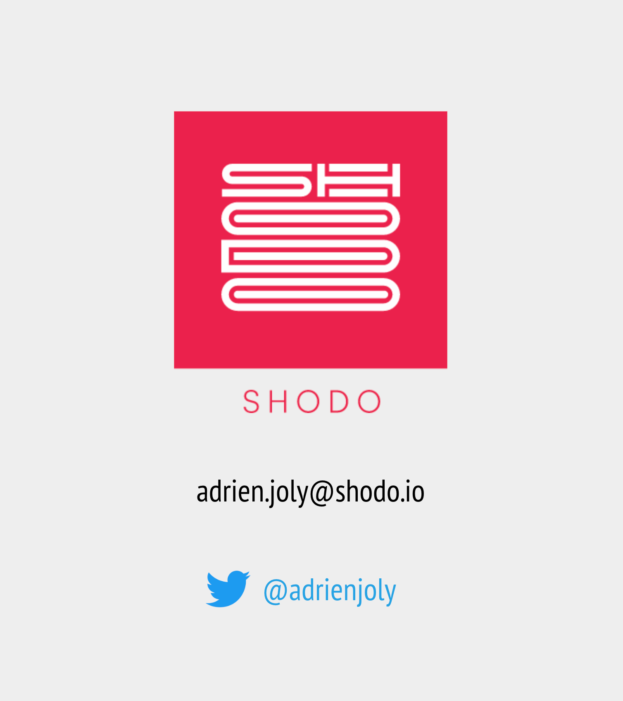

<!-- _class: centered -->
# Composer de la musique 8-bit en JavaScript
## Make "Game Boy" music in JavaScript




<!-- title slide -- intro -->

<!-- slides for show&tell: https://docs.google.com/presentation/d/16dDLewssNXK05C56JqK6lySWxZ3wHvEqtOgcqQPt5w4/edit#slide=id.g5707f48d32_0_4 -->

---
<!-- _class: topTitle -->
# Do you remember this?

@[youtube](BQwohHgrk2s)

<!-- 
Recently, I felt nostalgic about games from the late 80's. And more specifically about the esthetics of the music from vintage consoles of the era, like the Nintendo Entertainment System and Game Boy.

I wondered what made that sound so unique and recognizable, even for people who have never played these consoles.

Today, I'm gonna share with you a few facts that I found fascinating, while going down the rabbit hole of vintage Nintendo music.
-->

---

1. "Chiptune" basics
2. Howto & tricks
3. Remake in JavaScript

---
<!-- _class: topTitle -->
# Recorded Waveform (PCM)


<!-- PCM = Pulse-code modulation -->

---
<!-- _class: topTitle -->
# Channels & Waveforms

<!-- channels, from 8-bit guy's video https://www.youtube.com/watch?v=q_3d1x2VPxk -->


<!-- Some people may know that this kind of music is usually called "chip-tune". Why?

- NES: Ricoh 2A03 (custom MOS Technology 6502)
- Game Boy: Sharp LR35902 (hybrid between the Intel 8080 and the Zilog Z80)

Notes are played by synthesizing primitive waveforms (e.g. square, triangle)

Drums and percussions are simulated by moduling the output of a noise generator! -->

---
<!-- _class: topTitle -->
# Example: Maniac Mansion (NES)

<!-- Here’s a good example of percussive sounds made by the noise generator, a bass line played on the 2nd pulse channel, and a melody with various effects on the 1st pulse channel. -->

@[youtube](hWAtoCEuwnY)

<!-- ["Maniac Mansion (NES)" Full Soundtrack [Oscilloscope View] - YouTube](https://www.youtube.com/watch?v=hWAtoCEuwnY) -->

---
<!-- _class: topTitle -->
# Example: Super Mario Bros (NES)

<!-- Here’s a famous one on which you can hear a bass-line on the triangle channel. -->

@[youtube](OfrEoEQpPrI)

<!-- [[NES] Super Mario Bros.: Main Theme - Oscilloscope View - YouTube](https://www.youtube.com/watch?v=OfrEoEQpPrI) -->

---
<!-- _class: topTitle -->
# Trick: drums on noise + triangle channels

<!-- This track from “The Smurfs” (NES) features several cool tricks that make the sound fatter:
Drums on noise + triangle channels
Arpeggiator on one of the pulse channels, to simulate chords -->

@[youtube](Wy1l5BAkSoc)

<!-- [NES Smurfs: Mountains - oscilloscope view - YouTube](https://www.youtube.com/watch?v=Wy1l5BAkSoc) -->

<!-- Also:
[NES Audio: Triangle Kick Drum - YouTube](https://www.youtube.com/watch?v=Jd6nyynuzio)

=> TODO: Try to give a live example by muting the noise and pulse channels.
-->

---
<!-- _class: topTitle -->
# How was it made?

<!-- It was quite tedious. Musicians entered their song note per note and specified chip-supported effects by typing numbers in the last column. -->

@[youtube](GDP1kyoP8C4)

<!-- [Tetris (Game Boy) - Music Type B (Impulse Tracker Cover) - YouTube](https://www.youtube.com/watch?v=GDP1kyoP8C4) -->

---
<!-- _class: topTitle -->
# How ~~was it~~ can it also be made?

<!-- The NES band did something cool: give concerts in which they perform Nintendo music LIVE, on 4 keyboards. (one per channel)
It gave me an idea: wouldn’t it be cool to play chiptune music live with other instruments than keyboards? -->

@[youtube](HNs7BVn_bOk)

<!-- [マリオ3 SUPER MARIO BROS. 3 Medley / NES BAND 12th Live in Sapporo - YouTube](https://www.youtube.com/watch?v=HNs7BVn_bOk) -->

---
<!-- _class: topTitle -->
# Chiptune synth in JavaScript

<!-- This is what I started with: a MIDI synthesizer that can generate pulse, triangle and noise sounds. (https://github.com/adrienjoly/webmidi-launchkey-mini)
As a fan of the Web, I made it in JavaScript, using WebAudio and WebMIDI. Oscilloscope made by Jérôme Schneider -->

[](https://github.com/adrienjoly/webmidi-launchkey-mini)

<!-- DEMO TIME: PLAY TETRIS -->

---
<!-- _class: topTitle -->
# Howto: WebAudio Oscillator

```js
const audioContext = new window.AudioContext || window.webkitAudioContext
const gainNode = audioContext.createGain()
gainNode.connect(audioContext.destination)
```

---
<!-- _class: topTitle -->
# Howto: WebAudio Oscillator

```js
const audioContext = new window.AudioContext || window.webkitAudioContext
const gainNode = audioContext.createGain()
gainNode.connect(audioContext.destination)
```
```js
const oscillator = audioContext.createOscillator()
oscillator.type = 'triangle'
oscillator.frequency.value = 440
oscillator.connect(gainNode)
oscillator.start()
```

---
<!-- _class: topTitle -->
# Howto: WebAudio Oscillator

```js
function getNoteFreq ({ note, octave }) {
  const NOTES = [ 'C', 'C#', 'D', 'D#', 'E', 'F', 'F#', 'G', 'G#', 'A', 'A#', 'B' ]
  return 440 * ???
  🤔
}

oscillator.frequency.value = getNoteFreq({ note: 'C', octave: 4 })
oscillator.start()
```

---
<!-- _class: topTitle -->
# Howto: WebAudio Oscillator

```js
function getNoteFreq ({ note, octave }) {
  const NOTES = [ 'C', 'C#', 'D', 'D#', 'E', 'F', 'F#', 'G', 'G#', 'A', 'A#', 'B' ]
  return 440 * Math.pow(
    Math.pow(2, 1 / NOTES.length),
    (octave * 12) + NOTES.indexOf(note)
  )
}

oscillator.frequency.value = getNoteFreq({ note: 'C', octave: 4 })
oscillator.start()
```

---
<!-- _class: topTitle -->
# Next steps

- Tone modulation: ADSR enveloppe
- Arpeggiator
- Multi-channel
- Tape Recording

---
# Thank you!

Slides with links:




